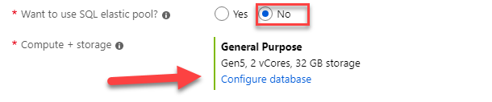
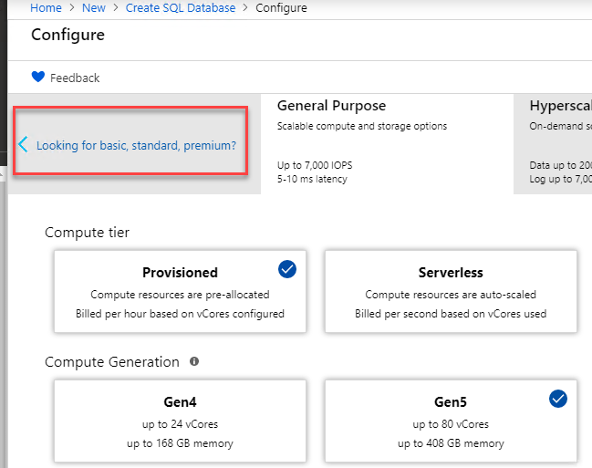
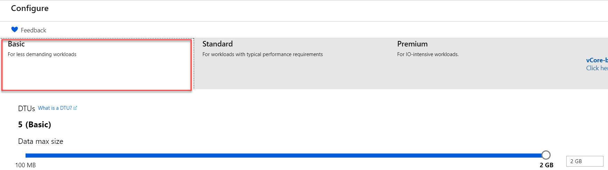

# Exercise 1: Create an Azure SQL database

## Overview

In this exercise, you will create a new SQL database.

## Task 1: Create an Azure SQL database in South Central US

1. From your browser, navigate to <https://portal.azure.com>, and in the top left corner press __Create a resource__ \> __Databases__ \> __SQL Database__.

1. Within the **Basics** Tab, enter your subscription and resource group information under **Project Details**.

    - Resource group: Use existing: __\<alias\>-rg__

    - Subscription: __Visual Studio Enterprise Subscription__

1. Enter your database name: __ContosoAdsSupport__ 

1. We will need to create a new database server. To do this, under the **Server** drop-down, select __Create new__.

1. Specify the following configuration (replace \<alias\> with your own username/alias):  
            
	  - Server name: __\<alias\>-southcentralus-sql__
    
	  - Server admin login: __demouser__
    
	  - Password: __demo@pass123__
    
	  - Confirm password: __demo@pass123__
    
	  - Location: __South Central US__

1. Close the SQL server configuration blade by selecting __OK__

1. Finally, specify the following for the remaining configuration on the SQL Database blade:

    - Want to use SQL elastic pool?: __No__
    
    - Compute + Storage: __Select Configure database__

      
        
1. Switch to DTU server model by selecting the link *'Looking for basic, standard, premium'*

    

1. **Select** Basic and then **select Apply**.

    

1. Complete the deployment by selecting __Review+Create__ to advance to the next step

1. Click on __Create__ to create your database server and database. This can take up to 5 minutes to deploy.

## Summary

In this exercise, you have created a new SQL database and SQL logical server for your new Contoso Ads Support Container Service.

