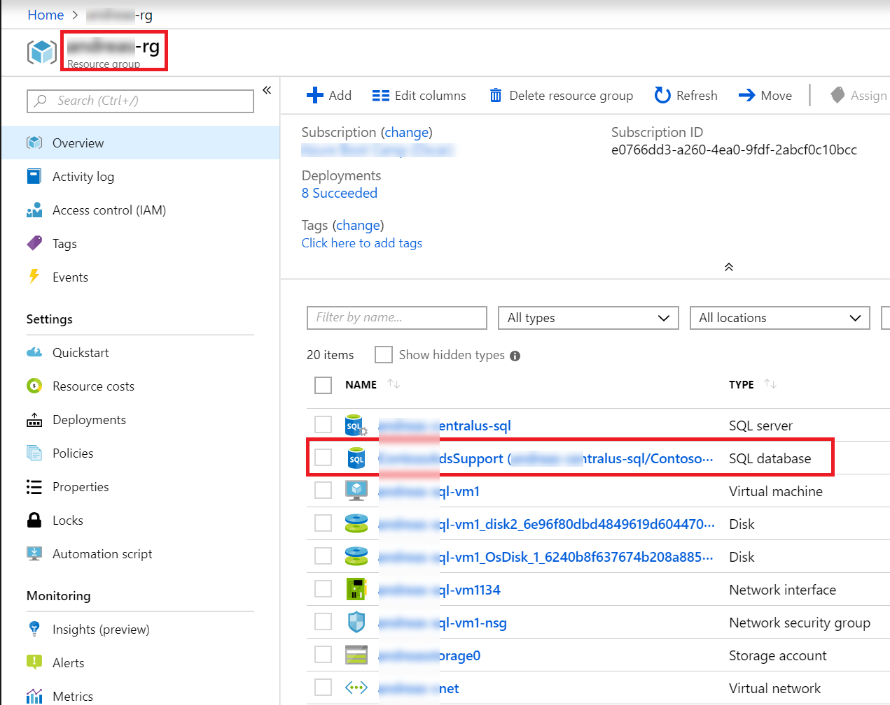

# Exercise 2: Configure Contoso Ads support application for containerization

## Overview

In this exercise, you will use the Docker Container engine already installed your the Virtual Machine to configure the Contoso Ads Support web application, learn how to build a Docker image of it, and then run the Contoso Ads Support application locally inside a Docker container.

## Task 1: Configure SQL database connection string

1. In the [Azure portal](https://portal.azure.com), open your resource group.

1. Open the __ContosoAdsSupport__ SQL database you created in the previous exercise.

    Note: make sure you select the database __ContosoAdsSupport__ (in *South Central US*) and not __ContosoAds__ (in *West Europe*), that you created earlier.

1. Select __Show database connection string__

    

1. Copy the __ADO.NET (SQL authentication)__ connection string using the copy icon on the right.

1. From your start menu, launch Visual Studio Code as administrator (right click select Run as Administrator). Then, __open__ the Contoso Ads Support *Web.config* file located at:
	```
	C:\StudentFiles\Introduce Customer Services - Introduction to Containers\ContosoAds.Support.Web\Web.config
	```

1. Find the connection string for ContosoAdsSupport. Replace the placeholder text *replace with azure sql connection string* with the connection string you copied from the portal. Make sure it still has quotes around it.

1. Within the connection string you just pasted replace the tokens with the values you entered when creating the SQL server in the last exercise.

    1. Replace *{your_username}* with __demouser__

    1. Replace *{your_password}* with __demo@pass123__

	1. Verify that the curly braces __{__ __}__ have been removed from the username and password.

    __Reminder:__ This is just a simplified example so you can focus on working with containers. For real projects, even non-production secrets should be stored in the appropriate secret stores and __not__ in the config file.

1. Save and close this file leaving the Visual Studio Code application open.

**TROUBLE SHOOTING**  You can find a quick walk through video showing web.config and SQL database creation [here](https://msit.microsoftstream.com/video/395fa1ff-0400-8385-05a4-f1eae1da273c)

## Task 2: Configure the Dockerfile

Docker can build images automatically by reading the instructions from a Dockerfile. A Dockerfile is a text document that contains all the commands a user could call on the command line to assemble an image. Using docker build users can create an automated build that executes several command-line instructions in succession. In this exercise we are building a simple image based on Microsoft ASP.NET that hosts a web application.

1. Open the following file using the **VSCode** application opened as administrator from your start menu:

	```
	C:\StudentFiles\Introduce Customer Services - Introduction to Containers\Dockerfile
	```

    This file will be currently empty.

1. Insert the following text into the __Dockerfile__:

    ```
    FROM microsoft/aspnet:4.6.2
    COPY ./ContosoAds.Support.Web/ /inetpub/wwwroot
    ```

    This tells Docker to create the new image based on the image *microsoft/aspnet:4.6.2* and then to extend this by copying the contents of *ContosoAds.Support.Web*, which contains the published Contoso Ads Support web application, to */inetpub/wwwroot*, which the IIS Web Server will make available for browsing.

1. Save and close this file.  If prompted, select to open and to save the file as admin.

## Task 3: Start the Docker service
The docker service is deployed as a Windows service and is set to start automatically on Windows start. In the next sections we will use the Docker service to create, build and deploy images. But before we get going, lets start the docker service and ensure it is running.

1. Open a Command Window as an Administrator:
    - On the Virtual Machine desktop, **select** the start button and enter **cmd**
    - Right click the command prompt and **select** 'run as administrator'

    	


1. Start the Docker service

    ```
    net start docker
    ```

    You should see a message similar to:

        The Docker Engine service is starting.
        The Docker Engine service was started successfully.

    If the service was already running you should see:

        The requested service has already been started.

1. If you get either of the above messages, the Docker service is up and running and we're ready to move on to the next task.

1. **Close** the Command Window

1. On the Virtual Machine desktop, **select** the start button and enter **docker**.  **Select** Docker Desktop to open the docker client

       


1. **Close** the Docker Desktop update Window

       


1. The Docker Engine can be used to run both Linux based containers and Windows based containers, but not at the same time.  The Contoso Ads Support applications will run on a Windows based container.  Configure the Docker Engine to interact with Windows based images by **selecting** the System Tray arrow in the bottom right hand corner of the desktop.  Right click the Docker whale icon and select *Switch to Windows containers...*

       


## Task 4: Build the Contoso Ads Support image and run in a local container

Now the Docker service is successfully running with Windows containers, we can start using it.

1. Disregard any DockerID login prompts as you will not need to login.  Open a new Powershell window **as administrator**
    - On the Virtual Machine Desktop, right click on the Windows Powershell icon
    - Select 'run as administrator'
    - If required, enter your credentials using password or pin

1. Browse to the student files directory for this lab:

    ```
    cd "C:\StudentFiles\Introduce Customer Services - Introduction to Containers\"
    ```

1. First, let's check the images you already have. Run the following command to list all the images installed.

    ```
    docker images
    ```

    In the results you should see one image that should be familiar based on what we were just looking at: An image with a repository of *microsoft/aspnet* and tag of *4.6.2*, or in short hand *microsoft/aspnet:4.6.2*.


1. Enter the following command to build a docker image using the Dockerfile you edited earlier.

    ```
    docker build -t contoso/ads-support .
    ```


    **NOTE:**   As you can see this image is rather large and it may take some time (10 to 15 minutes) to download from the public repository on first build.  You may chose to complete Task 5 below while waiting for the build and then return here to step 5.**

1. Check it built correctly. Run the following to look at what images you have:

    ```
    docker images
    ```

1. Enter the following command to run a container using the image (note: container name provided and image referenced by name, -d tells it to run detached and not connected to the command line)

    ```
    docker run -d --name testcontainer contoso/ads-support
    ```

1. Enter the following command to look at the running containers. You should see the one you just started.

    ```
    docker ps
    ```


## Task 5: Setting the SQL Service Firewall rule to allow access from your container

1. We need to set a firewall rule so that your SQL Server allows access from your container. The IP Address that the SQL Server will see is the public ip address of your VM (this is the VM that is hosting the container).

1. In the [Azure portal](https://portal.azure.com), open your resource group.

1. Open the __ContosoAdsSupport__ SQL database you created in the previous exercise.

    __Note:__ Make sure you select the database __ContosoAdsSupport (in *South Central US*)__ and __not ContosoAds (in *West Europe*)__, that you created in an earlier lab.

	


1. Access your database server by clicking on the name of the database server found under the __Server name__ in __Overview__ tab

	

1. On the __Overview__ tab for the database server, select the __Show Firewall Settings__ under __Firewalls and virtual networks__

	

1. On the Firewall and virtual networks blade, select __Add client IP__.  This will automatically add the public IP address of your VM as the __Start IP__ and __End IP__.

	


1. Under the setting **Allow Azure services and resources to access this server** select **Yes**.

    If we know that the connecting service to our SQL databases are going to be initiated from an Azure service, we can allow all Azure services and resources to access the server with a single setting. When we deploy our container workloads to Azure we will need them to connect to the SQL database.  


     

1. Under the setting **Connection Policy** select **Proxy**.  
In this instance we are looking to proxy all database connections inbound to our SQL database through a proxy IP dedicated for this region.  This may introduce some latency however, can be useful to simplify on-premises firewall rules (and is fine for our lab purposes).  You can find out more about Connection Policies [here](https://docs.microsoft.com/en-us/azure/azure-sql/database/connectivity-architecture#connection-policy). 


 	


1. Select __Save__. This firewall rule permits access to your ContosoAdsSupport database from the container running on your Virtual Machine as well as once deployed into Azure.

## Task 6: Testing ContosoAdsSupport application running in your container

1. Enter the following command to inspect the container to find the ip address it is running on (note the container is referenced by the name you gave it when you executed *docker run*)

    ```
    docker inspect -f "{{ .NetworkSettings.Networks.nat.IPAddress }}" testcontainer
    ```

    This will return the IP Address you can use to connect to your container.

1. Open Edge or Chrome and browse to your container. Enter the IP Address you found from inspecting your container into a web browser. Note: because this is based off the microsoft/aspnet image, it maps port 80:80 by default so you can access the website on the default http port. If you were running a service that required a different port to connect you would need to configure this yourself.

1. If you scroll down to the footer of the page, you should see that the web app is seeing that it has the same IP Address that you used to browse to it. You will also see what the web app thinks is the host name of the machine it is running on. If you look back at your PowerShell window where you ran *docker ps*, this will be the same as the __CONTAINER ID__.

1. You can now stop your container and verify its status as __Exited__ with the following commands:

    ```
    docker stop testcontainer
    docker ps -a
    ```

1. Once the container is stopped you may remove it.

    ```
    docker rm testcontainer
    ```

1. Listing all of the containers at this point should not return any.

    ```
    docker ps -a
    ```

**TROUBLESHOOTING**  You can find a quick walk-through video of this exercise [here](https://msit.microsoftstream.com/video/395fa1ff-0400-8385-05a5-f1eae1da273c)


## Summary

In this exercise, you have learned how to create a basic Dockerfile and then use this to build a docker image containing ASP.NET and Contoso Ads Support and then run and test it in a container using Docker for Windows.
