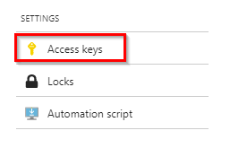
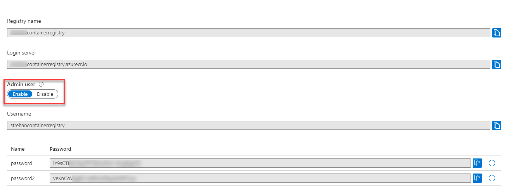
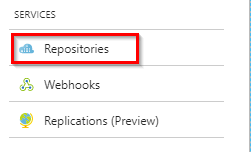
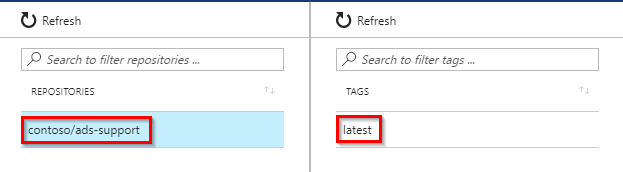

# Exercise 3: Azure Container Registry

## Overview

In this exercise, you will create an Azure Container Registry and push the image you created in the previous exercise to it.

## Task 1: Create a container registry

1. From your browser, navigate to <https://portal.azure.com>, select __Create a resource__ \> __Containers__ \> __Container Registry__.

1. Specify the following configuration (replace \<alias\> with your own username/alias):  
    
    - Subscription: __Visual Studio Enterprise Subscription__
    
    - Resource group: Use existing: __\<alias\>-rg__
    
    - Registry name: __\<alias\>containerregistry__
      
    - Location: __Central US__

    - SKU: __Basic__

1. Select __Review and Create__ and then select __Create__.

## Task 2: Push your image

1. Once your Container Registry has completed deploying, open it from your resource group, or select __Go to resource__ in the notification.

1. Select __Access keys__ under __Settings__.

    

1. You should see the  __Login server__ address, and the __Admin user__ enabled.  If the __Admin user__ is not set to enabled, then set this to enabled.  You will then see the __Username__, and two passwords. Keep this page open, you will need this information for the next steps.

        

2. Enter the following command to login to your container registry (use Power Shell). Replace \<login server\>, \<username\> and \<password\> with the values on the __Access Keys__ page for your container registry. Your \<password\> value should come from the __password__ name on __Access Keys__, _NOT_ __password2__ 
    
    ```
    docker login <login server> -u <username> -p <password>
    ```
	
	If this command is successful you will see __Login Succeeded__. 
	
	Because using plain text passwords in this way is insecure, you will also see the following warning: *WARNING! Using --password via the CLI is insecure. Use --password-stdin.* You can ignore this today, but be aware that you would not use this in a production build system, for example, where the password may be saved in log files.	
	
1. Enter the following command to tag your image with the registry path, so that it knows where to push it. Replace \<login server\> with your container registry login server (not the container registry username). 
    
    ```
    docker tag contoso/ads-support <login server>/contoso/ads-support
    ```
	__Note:__ Having the login server in the tag gives the push command you will be using in the next step the information it needs about the registry host to push the image to.

1. Stop and check you have completed each of the previous steps to login and tag your image correctly.  Then enter the following command to push docker image to your container registry. Replace \<login server\> with your container registry login server.
    
    ```
    docker push <login server>/contoso/ads-support
    ```

    You can watch the status of each of the layers your image and the *microsoft/aspnet* image are build on as they are pushed to your Container Registry. An error here may indicate previous steps to tag the image have not been completed.

1. Once the push has completed, the image is now in your container registry and ready to deploy. You can see this in the [Azure portal](https://portal.azure.com) by opening your container registry and selecting __Repositories__.

    

1. You should see a *contoso/ads-support* repository and if you select that, a *latest* tag. 

    Note: latest is the default tag if you don't specify a version number.

    

**TROUBLE SHOOTING**  You can find a quick walk through video of this exercise [here](https://msit.microsoftstream.com/video/395fa1ff-0400-8385-05a6-f1eae1da273c)

## Summary

In this exercise, you learned how to create an Azure Container Registry and how to push an image to it.
